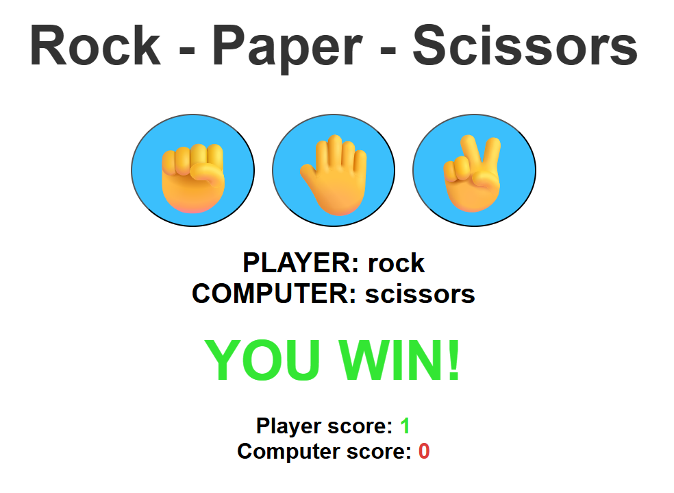

# 🎮 Rock Paper Scissors Game

A simple and fun **Rock-Paper-Scissors** game built using **HTML, CSS, and JavaScript**.  
Play against the computer, keep track of scores, and enjoy the classic hand game online!

---

## 🚀 Live Demo
👉 [Play the game here](https://sathvik-04.github.io/Rock-Paper-Scissors-game/)  

---

## 📸 Preview
  

---

## ✨ Features
- 🎨 Clean and responsive UI
- 🤖 Computer makes random choices
- ✅ Win/Loss/Tie detection
- 🟢 Player and 🔴 Computer **score tracking**
- ⚡ Fast and lightweight – runs in any browser

---

## 🛠️ Technologies Used
- **HTML5**
- **CSS3 (Flexbox, styling)**
- **Vanilla JavaScript (DOM manipulation, game logic)**

---

## 📂 Project Structure
